<h1>Teste API de envios automatizados</h1>
<br>

**Requisitos:**
<p>"Projeto teste Raphael
TÍTULO: Envios agendados NODEJS

1. Criar uma estrutura de dados(mongo, sql, redis,google sheets,....)
1.1. importar/cadastrar contatos(nome, numero)

2. Cadastrar envios
 Estrutura:
  nome(string),
  numero(string),
  msg(string),
  data_criado(datetime),
  data_envio(datetime),
  status(string)
2.2 listar envios com filtro de data
2.3 Enviar na data correta"</p>

<h2> Cronologia:</h2>
 <strong>(Criação do banco de dados -- Estuturação de API arquitetura escolhida -> Rest -- Conexão PostgreSQL com o banco de dados --implementação de funcionalidades (cadastrar , update, deletar, filtrar e envio automatizado )-- conexão com API wpp  ). </strong>

 <br>
 <h2>Resumo do projeto</h2>

<h3>Craição do bacno de dados</h3>
<p> A criação do banco de dados foi feita através de banco de dados relacional , com PostgreSQl e software Beekepper para o manuseio e consulta de dados, tabelas e bancos.</p>
<br>
<p>No arquivo <strong>schema.SQL</strong> pode ter acesso ao código SQl de criação.
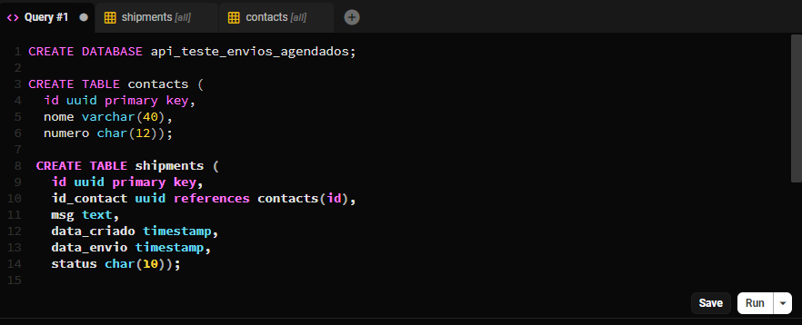
<br>
<p> Resolvi inserir alguns dados para os testes na API </p>
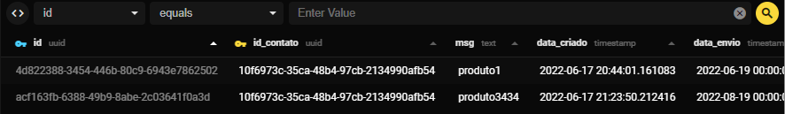
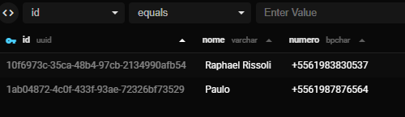

<p>Para a utilização do tipo uuid utilizei um gerador de id's aleatórios chamado <a href = 'https://www.uuidgenerator.net'>idGenerator</a>
<br>
<p> <strong>Observações:</strong><br>
Pensei em criar em MongoDB(não relacional) como pedido, até tentei e consegui conectar tudo. Porém nunca tinha utilizado , e por ter familiaridade com Postgre,  optei por utilizar relaciona mesmo.
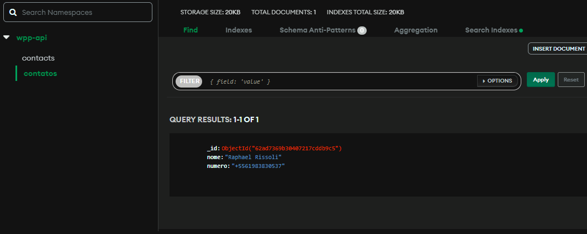

---
<h2> Estruturação  API Rest </h2>

<p> Utilizei modelo Rest pelo motivo de ter mais familiaridade com arquivos.Json , Mas não teria problema em recompilar para  modelo SOAP. </p>
<p> Todas as querys doram testados no insimnia.</p>
<strong>Pacotes utilizados para estruturação e teste:</strong>

1. npm express (rodar a API e fazer os testes em localhost);
2. npm nodemon;
3. npm cors;

<strong>Testes e instruções salvos na pasta 'test.insomnia' </strong>

<h3>Listagem de contatos</h3>
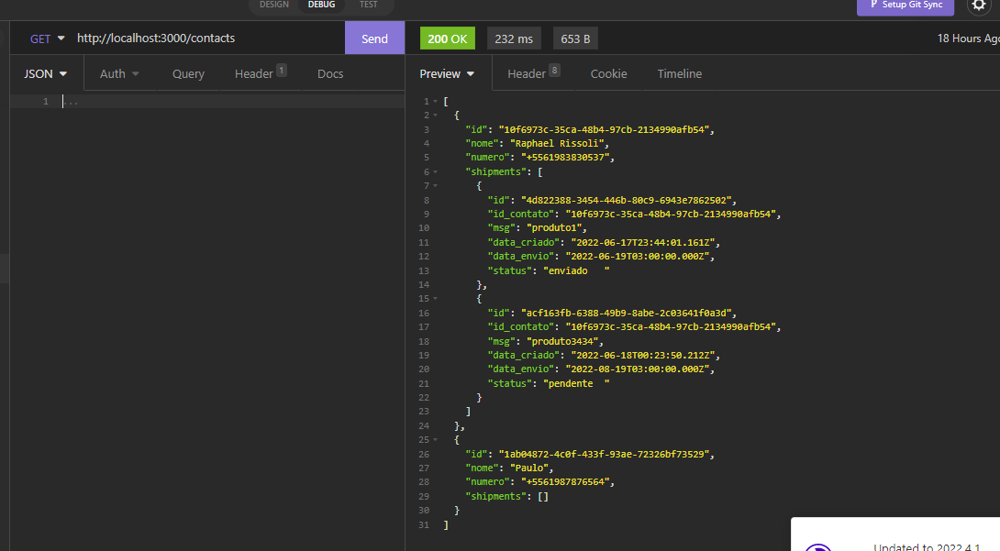
<p> As listagens dos contatos apresentava todas as suas informações e suas mensagens enviados, com as informações das mesmas.

<h3>Cadastro de Contatos</h3>
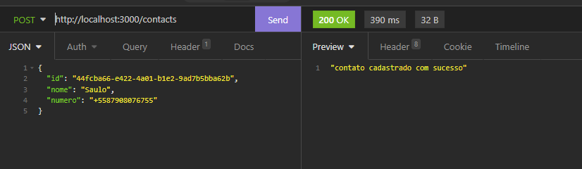
<strong> Se eu tenta-se cadastrar alguem com mesmo id ou numero:</strong>
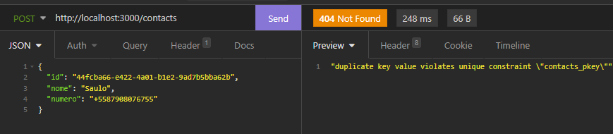
<strong> Atualização instantanea no banco:</strong><br>
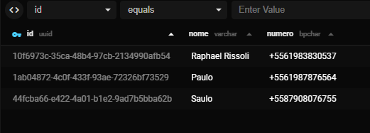

---

<h3> Listagem de envios</h3>

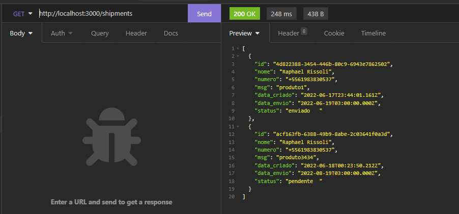

<p> A listagem de mensagens retornava , as informações da mensagem com a data de criação no momento que ela é criada e a de envio no momento que escolhi para ser enviada. Vinha tambèm com as informações do usário que enviou (nome e numero). </p>

<h3>Criação de mensagem </h3>
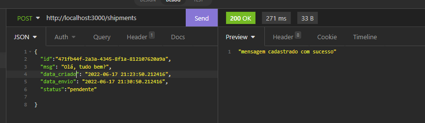
<p>Cadastrar a mensagem me permite colocar o horario de envio da mensagem e colocar o status dela</p>
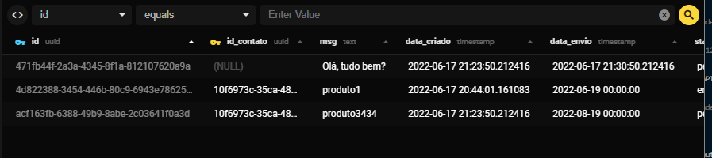
Atualização no momento de cadastro.

<h3>Filtrar por data</h3>

<p>A funcionalidade de filtrar por data foi implementada , porém,  quando fui utilizar o código quebrou por conta da lib utilizada por mim ( npm data-fns), pois ela transformava em date , e no meu banco só aceitava modelo "timestamp", como meu tempo estava escasso , optei por deixar por final e não foi implementado com sucesso. </p>


---

<h3>Tentativas de conexão com a Api fornecida</h3>

<p>A saga de tentativas de me conectar com a Api fornecida começou após eu terminar de estruturar a minha Api(a que conversa com o banco de dados).
Confesso que não sabia por onde começar, por não ter feito nenhum tipo de conexão api com api.
Comecei minha pesquisa e achei uma lib chamada axius que faz essa conexão, passei boa parte do tempo dado , estudando como faria para consumir e enviar dados. Isto consumiu muito do meu tempo.</p>

<br>
<p>Após algumas horas tentando me conectar com a Api fornecida:</p>
```javascript
// Send a POST request
axios.post('https://dev.integrador.saltzap.com/webhook/33602533-478f-4c6b-83bc-d65c6f20b285'{
  'method': 'POST',
  'headers': {
    'Content-Type': 'application/json'
  },
  body: JSON.stringify({
    "id": "554699121548",
    "msg": "testeeee"
  })
})then(reponse => {}).cathc(erro => console.log(erro.message));
```
<p>Consegui achar o arquivo.json que em tese daria para alterar e fazer post que o teste pedia, porém todas as tentaivas só consegui alterar os dados do data</p>
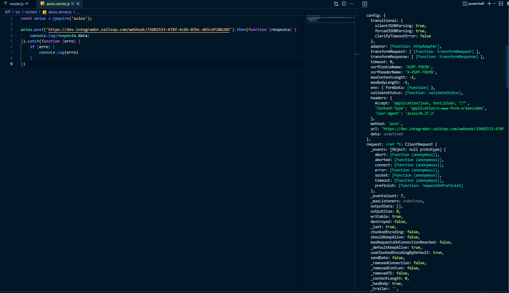

<p>Foi então que deixei de lado essa implementação e tentei criar minha própria Api post pra receber os dados, para nâo ser totalmente em vão. </p>

<p>Na pasta 'axiosAPI' , é uma pagina que recebe todos os dados e monstra no browser (detalhe importante , o conhecimento adquirido em axius , foi utilizado nesta pagina para a integração</p>

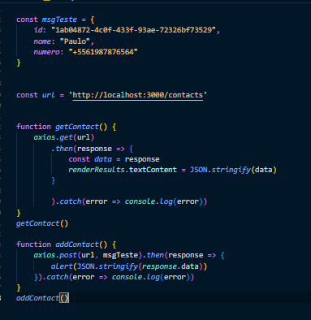
<p> E enfim o axius funcionou , tentei até conectar com a API novamente , trocando a url. Mas, não deu sucesso, ele voltava um "network Erro"</p>
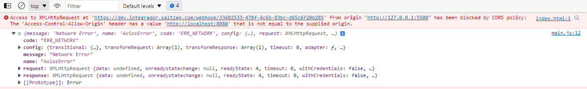

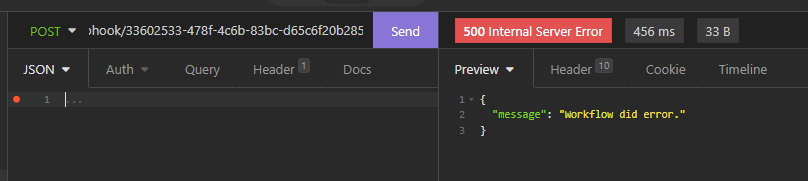

<p>Então com pouco tempo sobrando que recorri a pessoas que poderiam me ajudar.
Descobri  talvez se tivesse ido atrás de fazer um webserver, com web service, e estudado isso tivesse me saído melhor no teste.
já sem tempo para implementar muita coisa, fiz uma revisão do código, deixando tudo limpo..
</p>
<h3>Como faria para disparar mensagens automáticas</h3>

<p>Mesmo sem minha Api estar conectada com a Api fornecida, já pensava em uma forma de disparar mensagens automáticas na data que foi estipulada, dei uma olhada em algumas libs para me ajudar e dar uma luz.</p>
1.
<a href='https://github.com/orkestral/venom'>VenomBot</a>
<p>É uma API alternativa de alto desempenho ao whatzapp, você pode enviar mensagens de texto, arquivos, imagens, vídeos e muito mais.
Lembre-se, a API foi desenvolvida em uma plataforma chamada RESTful Web Services, proporcionando interoperabilidade entre sistemas computacionais na Internet.
Utiliza um conjunto de operações bem definidas que se aplicam a todos os recursos de informação: o próprio HTTP define um pequeno conjunto de operações, sendo as mais importantes POST, GET, PUT e DELETE.
Use-o em sua linguagem favorita como PHP, Python, C# e outras. contanto que seu idioma seja compatível com o protocolo HTTP, você economizará tempo e dinheiro. você não precisa saber como o Venom funciona, nós temos a documentação completa da API, de forma profissional.

A alternativa mais "simples" em termos de escrita de código , mas precisaria que minha Api ja escrita em JS fosse escrita em Typescript.
</p>
2. <a href='https://www.npmjs.com/package/cron'>Cron Lib</a>
<p>Cron é uma ferramenta que permite executar algo em um cronograma. Isso geralmente é feito usando a sintaxe cron. Permitimos que você execute uma função sempre que seu trabalho agendado for acionado. Também permitimos que você execute um trabalho externo ao processo javascript usando child_process. Além disso, essa biblioteca vai além da sintaxe cron básica e permite que você forneça um objeto Date. Isso será usado como o gatilho para seu retorno de chamada. A sintaxe Cron ainda é um formato CronTime aceitável. Embora os padrões Cron suportados aqui se estendam no formato Unix padrão para dar suporte a dígitos de segundos, deixá-lo desativado terá o padrão 0 e corresponderá ao comportamento Unix.

Essa ferramenta seria a mais correta na parte onde já estava.
Faria com que a cada dia fosse filtrado os "data_envio" do banco de dados, e disparado nos horários determinados,ou seja, em sua função callback colocaria 24 horas, e seria feito um filtro com as mensagens daquele dia e disparado nos horários.
</p>

---

<h1>Considerações Finais</h1>

<p>Este projeto não esta finalizado, algumas implementações precisam ser feitas, como conexão com a Api wpp fornecida e o disparo automatico (tenho uma ideia de como implementar o último).

Porém, adquiri muito conhecimneto de algumas libs das quais nunca tinha visto.

Talvez meu começo do projeto tivesse ido por outro caminho sem ser pela lib axius , teria concluido ou chegaria mais perto do pedido.
</p>
